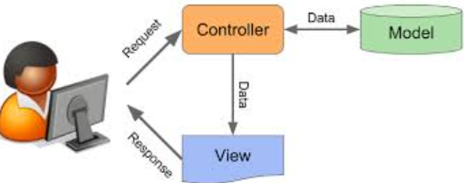

# Padrão MVC no Sistema de Locadora de Veículos

Este documento explica o que é o padrão de projeto MVC (Model-View-Controller) e como ele é aplicado no sistema de locadora de veículos desenvolvido em PHP, com autenticação de usuários, gerenciamento de veículos (carros e motos) e interface baseada em Bootstrap.

## 1. O que é o Padrão MVC?

O **MVC (Model-View-Controller)** é um padrão de arquitetura de software utilizado para organizar o código de aplicações, separando as responsabilidades em três componentes principais:

### 1.1. Model (Modelo)
- **Função**: Representa os dados, a lógica de negócios e as regras da aplicação. É responsável por gerenciar o estado dos dados, interagir com o banco de dados ou fontes de dados, e realizar operações como validações e cálculos.
- **Características**:
  - Não depende da interface de usuário.
  - Notifica a View sobre mudanças nos dados.
  - Mantém a lógica de manipulação dos dados centralizada.

### 1.2. View (Visão)
- **Função**: Responsável pela apresentação dos dados ao usuário, ou seja, a interface de usuário (UI). Exibe os dados fornecidos pelo Model e envia interações do usuário para o Controller.
- **Características**:
  - É tipicamente composta por HTML, CSS e JavaScript (ou templates, como no caso de PHP).
  - Não contém lógica de negócios, apenas formatação e exibição.

### 1.3. Controller (Controlador)
- **Função**: Atua como um intermediário entre o Model e a View. Recebe entradas do usuário (via View), manipula o Model para atualizar os dados ou realizar ações, e seleciona a View apropriada para renderizar os resultados.
- **Características**:
  - Processa solicitações (requests), geralmente via HTTP (GET/POST).
  - Coordena a interação entre Model e View, mantendo a separação entre eles.

### 1.4. Benefícios do MVC
- **Separação de preocupações**: Facilita a manutenção, teste e escalabilidade do código.
- **Reutilização**: Modelos e Views podem ser reutilizados em diferentes partes da aplicação.
- **Flexibilidade**: Permite alterações na interface sem afetar a lógica de negócios, e vice-versa.

## 2. Como o Padrão MVC Funciona no Sistema

O sistema de locadora de veículos é estruturado seguindo o padrão MVC, embora de forma simplificada, devido ao uso de PHP puro e sem frameworks MVC completos (como Laravel ou Symfony). Abaixo, detalho como cada componente é implementado e interage no projeto.

### 2.1. Model (Modelo)
- **Localização**: Classes no diretório `models/` e `services/`.
- **Implementação**:
  - **Classes `Veiculo`, `Carro` e `Moto` (em `models/`)**:
    - Representam os dados e a lógica dos veículos (carros e motos).
    - Contêm propriedades como `modelo`, `placa` e `disponivel`, além de métodos como `calcularAluguel()`, `alugar()`, `devolver()` e `isDisponivel()`.
    - A interface `Interfaces\Locavel` define o contrato para veículos locáveis.
  - **Classe `Services\Locadora` (em `services/`)**:
    - Gerencia a coleção de veículos, interagindo com `veiculos.json` para persistência.
    - Implementa métodos como `adicionarVeiculo()`, `alugarVeiculo()`, `devolverVeiculo()`, `deletarVeiculo()` e `calcularPrevisaoAluguel()`.
  - **Classe `Services\Auth` (em `services/`)**:
    - Gerencia os usuários, interagindo com `usuarios.json` para autenticação e autorização.
    - Implementa métodos como `login()`, `logout()`, `verificarLogin()`, `isAdmin()` e `getUsuario()`.
- **Exemplo de Interação**:
  - O `Locadora` carrega e salva veículos em `veiculos.json` usando `json_decode()` e `json_encode()`.
  - O `Auth` gerencia autenticação e perfis, salvando em `usuarios.json`.

### 2.2. View (Visão)
- **Localização**: Arquivos em `views/` e `public/` (templates HTML).
- **Implementação**:
  - **Arquivo `views/template.php`**:
    - Responsável pela interface principal, exibindo a lista de veículos, formulários para adicionar veículos, calcular previsão de aluguel, e botões para ações (alugar, devolver, deletar).
    - Utiliza Bootstrap para estilização e Bootstrap Icons para ícones (ex.: ícone de usuário e seta no botão "Sair").
    - Recebe dados do Controller (`index.php`) via variáveis como `$locadora`, `$mensagem` e `$usuario`.
  - **Arquivo `public/login.php`**:
    - Exibe o formulário de login, estilizado com Bootstrap, e mensagens de erro, se houver.
- **Exemplo de Interação**:
  - `template.php` exibe uma tabela com veículos usando `$locadora->listarVeiculos()` e condiciona a exibição de ações com base no perfil (`Auth::isAdmin()`).
  - `login.php` mostra um formulário simples para autenticação, sem lógica de negócios.

### 2.3. Controller (Controlador)
- **Localização**: Arquivo `public/index.php` e parcialmente em `public/login.php`.
- **Implementação**:
  - **Arquivo `public/index.php`**:
    - Recebe solicitações do usuário (via GET/POST) e coordena as ações entre Model e View.
    - Instancia `Services\Locadora` e `Services\Auth` para manipular dados.
    - Processa ações como:
      - Adicionar veículo (`adicionar`).
      - Alugar veículo (`alugar` com dias).
      - Devolver veículo (`devolver`).
      - Deletar veículo (`deletar`).
      - Calcular previsão de aluguel (`calcular`).
    - Verifica permissões usando `Auth::isAdmin()` para restringir ações administrativas.
    - Renderiza `views/template.php`, passando variáveis como `$locadora`, `$mensagem` e `$usuario`.
  - **Arquivo `public/login.php`**:
    - Recebe o formulário de login (POST) e usa `Services\Auth` para autenticação.
    - Redireciona para `index.php` após login bem-sucedido ou exibe mensagem de erro.
- **Exemplo de Interação**:
  - Quando um admin clica em "Alugar" na tabela, `index.php` recebe o POST, chama `Locadora::alugarVeiculo()`, atualiza `veiculos.json`, e passa a mensagem para `template.php` exibir.

## 3. Aplicação do MVC no Projeto

### 3.1. Separação de Responsabilidades
- **Model**: Contém toda a lógica de negócios e persistência dos dados (classes em `models/` e `services/`).
  - Ex.: `Carro::calcularAluguel()` calcula o custo com base na diária, e `Locadora::salvarVeiculos()` persiste em `veiculos.json`.
- **View**: Responsável apenas pela apresentação (arquivos em `views/` e `public/`).
  - Ex.: `template.php` exibe a tabela de veículos e formulários, sem manipular dados diretamente.
- **Controller**: Coordena as interações, processando requisições e invocando Model/View.
  - Ex.: `index.php` processa o clique em "Alugar", chama `Locadora::alugarVeiculo()`, e renderiza `template.php` com a mensagem.

### 3.2. Fluxo Típico
1. Um usuário acessa `login.php` e faz login (Controller).
2. `login.php` usa `Auth` (Model) para verificar credenciais em `usuarios.json`.
3. Após login, redireciona para `index.php`, que instancia `Locadora` (Model) e verifica o perfil com `Auth`.
4. `index.php` (Controller) processa ações como alugar um veículo, chamando métodos de `Locadora`.
5. `template.php` (View) exibe os dados (veículos, mensagens) com base no perfil do usuário, mostrando ou escondendo ações administrativas.

### 3.3. Perfis de Acesso no MVC
- O controle de acesso é implementado no Controller (`index.php`) e Model (`Auth`):
  - `Auth::isAdmin()` verifica se o usuário é admin, restringindo ações em `index.php`.
  - `template.php` usa `Auth::isAdmin()` para condicionar a exibição de formulários e botões (ex.: "Adicionar Novo Veículo" e ações na tabela).
- Exemplo: Um admin vê botões "Deletar", "Devolver" e "Alugar" na tabela, enquanto um usuário só vê a lista de veículos.

## 4. Vantagens da Aplicação do MVC neste Projeto
- **Manutenção Simplificada**: A separação permite modificar a interface (`template.php`) sem afetar a lógica de negócios (`models/` e `services/`).
- **Reutilização**: A lógica de aluguel (`Carro`, `Moto`, `Locadora`) pode ser reutilizada em outras partes do sistema.
- **Escalabilidade**: É fácil adicionar novos modelos (ex.: caminhões) ou funcionalidades, mantendo a organização.

## 5. Limitações e Considerações
- Este é um MVC simplificado, sem um framework completo, então há mais código boilerplate (ex.: gerenciamento manual de sessões e JSON).
- A persistência em arquivos JSON é limitada para aplicações maiores; um banco de dados seria mais adequado para escalabilidade.
- O sistema não inclui roteamento avançado, mas o padrão MVC ainda é aplicável e útil.

## 6. Conclusão
O sistema de locadora de veículos implementa o padrão MVC de forma eficaz, separando Model (dados e lógica), View (interface) e Controller (coordenação). Os perfis de acesso (admin e usuário) são gerenciados pelo Model (`Auth`) e Controller (`index.php`), com a View (`template.php`) adaptando a interface com base nas permissões, garantindo uma aplicação organizada, escalável e fácil de manter.

