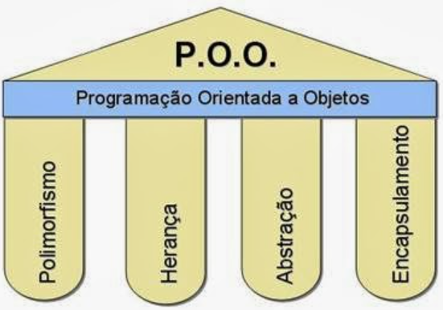

# Programação Orientada a Objetos (POO) no Sistema de Locadora de Veículos

Este documento explica o que é a Programação Orientada a Objetos (POO) e como ela funciona, detalhando seus quatro pilares fundamentais (Encapsulamento, Abstração, Herança e Polimorfismo). Também descreve como a POO é aplicada no sistema de locadora de veículos desenvolvido em PHP, com autenticação de usuários, gerenciamento de veículos (carros e motos) e interface baseada em Bootstrap. A data atual é 21 de fevereiro de 2025.

## 1. O que é Programação Orientada a Objetos (POO)?

A **Programação Orientada a Objetos (POO)** é um paradigma de programação que organiza o código em torno de "objetos", que combinam dados (atributos) e comportamentos (métodos). Em vez de escrever código procedural (baseado em funções e sequências), a POO modela o software como entidades do mundo real, facilitando a reutilização, manutenção e escalabilidade.


### 1.1. Características Principais da POO
- **Objetos**: Instâncias de classes que representam entidades com dados e comportamentos.
- **Classes**: Modelos ou "blueprints" que definem as propriedades e métodos dos objetos.
- **Pilasres da POO**: Conceitos fundamentais que guiam o design orientado a objetos:
  1. **Encapsulamento**: Ocultar detalhes de implementação e expor apenas o necessário.
  2. **Abstração**: Simplificar complexidade, focando nos aspectos essenciais.
  3. **Herança**: Permitir que uma classe herde atributos e métodos de outra.
  4. **Polimorfismo**: Capacidade de objetos de diferentes classes responderem ao mesmo método de maneiras distintas.

## 2. Os Quatro Pilares da POO



### 2.1. Encapsulamento
- **Definição**: Protege os dados internos de uma classe, restringindo o acesso direto a atributos e expondo apenas métodos públicos (interfaces) para manipulá-los. Geralmente, usa modificadores de acesso como `public`, `protected` e `private`.
- **Benefícios**: Segurança, redução de erros e maior controle sobre o estado do objeto.
- **Exemplo no Mundo Real**: Um carro tem dados internos (motor, transmissão) que só podem ser acessados ou modificados por meio de controles (ex.: acelerar, frear).

### 2.2. Abstração
- **Definição**: Esconde detalhes complexos e expõe apenas as funcionalidades essenciais de um objeto. Classes abstratas ou interfaces são usadas para definir o que um objeto faz, não como faz.
- **Benefícios**: Simplifica o uso, focando na interface e não na implementação.
- **Exemplo no Mundo Real**: Você usa um controle remoto sem saber como o sinal é transmitido para a TV.

### 2.3. Herança
- **Definição**: Permite que uma classe herde atributos e métodos de outra classe, promovendo reutilização de código. A classe pai (superclasse) é extendida pela classe filha (subclasse).
- **Benefícios**: Reduz redundância e facilita a extensibilidade.
- **Exemplo no Mundo Real**: Um carro e uma moto herdam características de um "veículo" (rodas, motor), mas têm comportamentos específicos.

### 2.4. Polimorfismo
- **Definição**: Permite que objetos de diferentes classes sejam tratados como instâncias de uma classe pai ou interface comum, respondendo de maneiras distintas ao mesmo método.
- **Benefícios**: Flexibilidade e código mais genérico.
- **Exemplo no Mundo Real**: Um controle remoto pode ligar diferentes dispositivos (TV, som), mas o mesmo botão "ligar" tem comportamento específico para cada dispositivo.

## 3. Como a POO é Aplicada no Sistema

O sistema de locadora de veículos utiliza POO extensivamente, estruturando o código em classes e objetos para gerenciar usuários, veículos e operações. Abaixo, detalho como cada pilar da POO é implementado.

### 3.1. Encapsulamento
- **Implementação**:
  - Classes como `Models\Veiculo`, `Models\Carro`, `Models\Moto`, `Services\Locadora` e `Services\Auth` usam modificadores de acesso (`protected`, `private`) para ocultar dados internos.
  - Atributos como `$modelo`, `$placa` e `$disponivel` em `Veiculo` são `protected`, acessíveis apenas por métodos públicos como `getModelo()`, `getPlaca()` e `setDisponivel()`.
  - Exemplo em `Veiculo.php`:
    ```php
    protected string $modelo;
    protected string $placa;
    protected bool $disponivel;

    public function getModelo(): string {
        return $this->modelo;
    }
    ```
  - Em `Auth.php`, a propriedade `$usuarios` é `private`, e os métodos `carregarUsuarios()` e `salvarUsuarios()` gerenciam o acesso aos dados em `usuarios.json`.
- **Benefício**: Garante que os dados sejam manipulados apenas por métodos controlados, evitando alterações diretas e erros.

### 3.2. Abstração
- **Implementação**:
  - A interface `Interfaces\Locavel` define métodos abstratos (`alugar()`, `devolver()`, `isDisponivel()`) que `Carro` e `Moto` devem implementar, escondendo detalhes de como cada veículo realiza essas ações.
  - A classe abstrata `Models\Veiculo` fornece uma base comum para `Carro` e `Moto`, definindo o comportamento geral (ex.: construção do objeto com `modelo` e `placa`) e declarando o método abstrato `calcularAluguel()` para ser implementado pelas subclasses.
  - Exemplo em `Locavel.php`:
    ```php
    interface Locavel {
        public function alugar(): string;
        public function devolver(): string;
        public function isDisponivel(): bool;
    }
    ```
  - Exemplo em `Veiculo.php`:
    ```php
    abstract class Veiculo {
        abstract public function calcularAluguel(int $dias): float;
    }
    ```
- **Benefício**: Permite tratar `Carro` e `Moto` como objetos `Locavel` ou `Veiculo` genericamente, sem se preocupar com implementações específicas.

### 3.3. Herança
- **Implementação**:
  - `Models\Carro` e `Models\Moto` herdam da classe abstrata `Models\Veiculo`, reutilizando atributos (`$modelo`, `$placa`, `$disponivel`) e métodos (`getModelo()`, `getPlaca()`, `setDisponivel()`, `isDisponivel()`).
  - Ambas as classes também implementam a interface `Interfaces\Locavel`, herdando o contrato de métodos para locação.
  - Exemplo em `Carro.php`:
    ```php
    class Carro extends Veiculo implements Locavel {
        // Herda de Veiculo e implementa Locavel
    }
    ```
- **Benefício**: Reduz duplicação de código, pois `Carro` e `Moto` compartilham a lógica comum de `Veiculo`, mas podem ter comportamentos específicos (ex.: `calcularAluguel()` com diárias diferentes).

### 3.4. Polimorfismo
- **Implementação**:
  - `Carro` e `Moto` são tratadas como instâncias de `Veiculo` ou `Locavel`, permitindo que o mesmo método (`alugar()`, `devolver()`, `calcularAluguel()`) tenha comportamentos distintos.
  - Em `Services\Locadora`, o método `listarVeiculos()` retorna um array de `Veiculo`, e `alugarVeiculo()` opera em qualquer veículo que implemente `Locavel`, sem se preocupar com o tipo específico (carro ou moto).
  - Exemplo em `Locadora.php`:
    ```php
    public function alugarVeiculo(string $modelo, int $dias = 1): string {
        foreach ($this->veiculos as $veiculo) {
            if ($veiculo->getModelo() === $modelo && $veiculo->isDisponivel()) {
                $valorAluguel = $veiculo->calcularAluguel($dias);
                $mensagem = $veiculo->alugar();
                $this->salvarVeiculos();
                return $mensagem . " Valor do aluguel: R$ " . number_format($valorAluguel, 2, ',', '.');
            }
        }
        return "Veículo não disponível.";
    }
    ```
  - O polimorfismo permite que `Locadora` trabalhe com `Carro` ou `Moto` de forma genérica, chamando `calcularAluguel()` ou `alugar()` de maneira específica para cada tipo.
- **Benefício**: Facilita a extensão do sistema (ex.: adicionar novos tipos de veículos) e torna o código mais flexível.

## 4. Aplicação da POO no Sistema

### 4.1. Classes e Objetos
- O sistema é estruturado em classes que modelam entidades do mundo real:
  - **Usuários**: Gerenciados por `Services\Auth`, com objetos representando `username`, `password` e `perfil`.
  - **Veículos**: Representados por `Models\Veiculo`, `Models\Carro` e `Models\Moto`, com objetos contendo `modelo`, `placa` e `disponivel`.
- Instâncias dessas classes são criadas e manipuladas em `public/index.php` e `services/Locadora.php`.

### 4.2. Benefícios da POO no Projeto
- **Reutilização**: Classes como `Veiculo` são reutilizadas por `Carro` e `Moto` via herança.
- **Manutenção**: Encapsulamento e abstração facilitam alterações na lógica (ex.: mudar diárias em `config.php`) sem afetar a interface.
- **Extensibilidade**: O polimorfismo permite adicionar novos tipos de veículos (ex.: caminhões) implementando `Locavel` e extendendo `Veiculo`.

### 4.3. Exemplo Prático
- Quando um admin aluga um veículo em `index.php`:
  1. `Locadora::alugarVeiculo()` cria ou utiliza um objeto `Carro` ou `Moto` (herdado de `Veiculo`).
  2. O método `alugar()` (polimorfismo) é chamado, retornando uma mensagem específica ("Carro alugado" ou "Moto alugada").
  3. O estado (`disponivel`) é encapsulado e atualizado via `setDisponivel()`, salvando em `veiculos.json`.

## 5. Conclusão

O sistema de locadora de veículos aproveita a POO para criar um design modular e robusto. Os quatro pilares da POO—Encapsulamento, Abstração, Herança e Polimorfismo—são aplicados de forma consistente:
- **Encapsulamento**: Protege dados com modificadores de acesso e métodos de acesso.
- **Abstração**: Usa interfaces e classes abstratas para simplificar interações com veículos.
- **Herança**: Permite `Carro` e `Moto` herdarem de `Veiculo`, reduzindo redundância.
- **Polimorfismo**: Trata `Carro` e `Moto` como `Veiculo` ou `Locavel`, facilitando operações genéricas.

Essa abordagem orientada a objetos torna o sistema escalável, fácil de manter e preparado para futuras expansões, como a adição de novos tipos de veículos ou funcionalidades.

